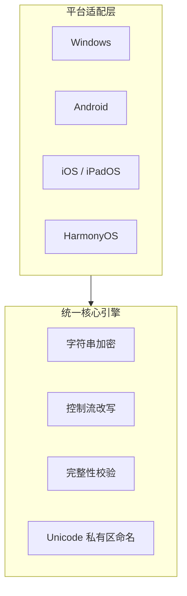

# PACC — POTATOTV Anti-Cheat Client


PACC（POTATOTV Anti-Cheat Client）采用「统一核心引擎 + 平台适配层」的架构设计，将同一套反作弊核心逻辑高效运行于 Windows、Android、iOS、iPadOS、HarmonyOS 等主流操作系统之上，为企业级赛事与服务器运营提供全平台、一体化的反作弊解决方案。

---

## 目录

- [背景](#背景)
- [核心特性](#核心特性)
- [架构设计](#架构设计)
- [快速开始](#快速开始)
- [项目结构](#项目结构)
- [路线图](#路线图)
- [贡献指南](#贡献指南)
- [许可证](#许可证)
- [致谢](#致谢)

---

## 背景

随着 Minecraft 基岩版在全球多平台的普及，作弊行为呈现出跨平台、多样化、隐蔽化的趋势。传统反作弊方案往往只支持单一平台，无法满足企业级赛事与服务器运营的全平台防护需求。

PACC 旨在解决这一痛点：通过将核心检测逻辑与平台适配层解耦，实现一次开发、多端部署的反作弊能力，降低跨平台维护成本，同时保持各平台上一致的检测精度与响应速度。

---

## 核心特性

- **统一核心引擎**：字符串加密、控制流改写、完整性校验、Unicode 私有区命名等反作弊核心能力在核心引擎层统一实现，平台适配层仅负责调用与结果回传，避免逻辑碎片化。
- **全平台覆盖**：原生支持 Windows、Android、iOS、iPadOS、HarmonyOS，一套核心逻辑即可在不同平台上运行。
- **企业级部署**：面向企业级赛事与服务器运营场景设计，支持规模化部署与集中管理。
- **Java 技术栈**：核心引擎基于 Java 构建，依托 JVM 生态的跨平台能力实现高效移植。

---

## 架构设计

PACC 采用「统一核心引擎 + 平台适配层」的分层架构：



如果 Mermaid 无法渲染，以下文本描述：

- **平台适配层**：Windows、Android、iOS / iPadOS、HarmonyOS
- **统一核心引擎**：字符串加密、控制流改写、完整性校验、Unicode 私有区命名
- **调用关系**：平台适配层调用统一核心引擎，核心引擎不依赖具体操作系统。

---

## 快速开始

### 环境要求

- Java 17 或更高版本
- Maven 3.8+

### 构建

```bash
git clone https://github.com/EPOTATOTV/PACC_POB.git
cd PACC_POB
mvn clean package
```

构建产物将生成在 `target/` 目录下。

### 运行测试

```bash
mvn test
```

---

## 项目结构

```text
PACC_POB/
├── pom.xml              # Maven 项目配置
├── src/                 # 源代码目录
│   ├── main/
│   │   ├── java/        # Java 核心引擎与平台适配层
│   │   └── resources/   # 资源配置文件
│   └── test/            # 单元测试
└── README.md
```

---

## 路线图

- [ ] 完善字符串加密模块的算法强度
- [ ] 扩展 HarmonyOS 平台适配层的功能覆盖
- [ ] 增加完整性校验的运行时自检机制
- [ ] 提供企业级部署文档与配置指南
- [ ] 补充多语言 README 与 API 文档

---

## 贡献指南

欢迎参与 PACC 的开发与改进。请遵循以下流程：

1. Fork 本仓库
2. 创建功能分支（`git checkout -b feature/your-feature`）
3. 提交更改（`git commit -m 'feat: add your feature'`）
4. 推送分支（`git push origin feature/your-feature`）
5. 发起 Pull Request

提交信息请遵循 [Conventional Commits](https://www.conventionalcommits.org/) 规范。

---

## 许可证

本项目采用 MIT 许可证。详见 [LICENSE](LICENSE) 文件。

---

## 致谢

- 感谢所有为 PACC 项目做出贡献的开发者
- README 结构参考了 [Best-README-Template](https://github.com/othneildrew/Best-README-Template) 与 [oss-readme-template](https://github.com/0xelitesystem/oss-readme-template) 的最佳实践
